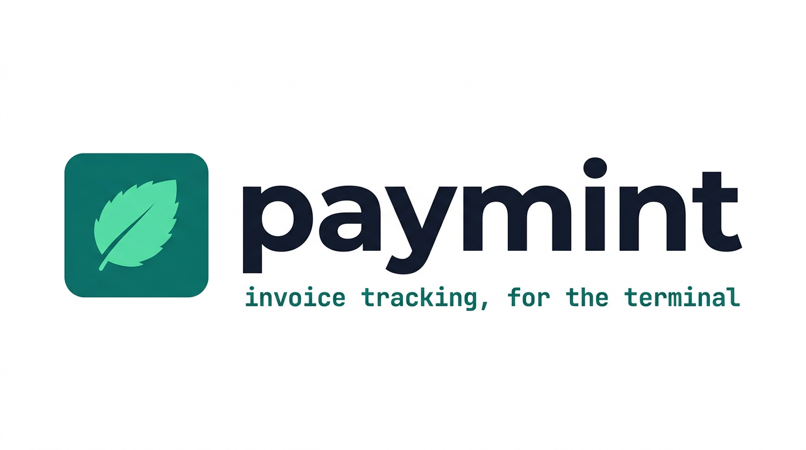

<p align="center">
  
</p>

<p align="center">
  <a href="https://github.com/vanducng/paymint/releases/latest"></a>
  <a href="https://github.com/vanducng/paymint/actions/workflows/ci.yml"></a>
  <a href="https://goreportcard.com/report/github.com/vanducng/paymint"></a>
  <a href="https://pkg.go.dev/github.com/vanducng/paymint"></a>
  <a href="./LICENSE"></a>
  
</p>

<p align="center">
  <b>A single-binary Go CLI that tracks invoices, contracts and payments — </b><br/>
  <b>synced to a Google Sheet, snapshotted to git, exported as PDFs.</b>
</p>

<p align="center">
  Built for consultants and contractors who think in <code>git log</code> but invoice in <code>USD</code>.
</p>

---

## Why paymint?

Spreadsheets are great for clients ("just open the link"). They're awful for *you*: no diff, no history, no scriptable workflow, and one fat-fingered cell can wreck a month of billing.

paymint keeps the sheet **as the public surface** and adds the things developers expect underneath:

- A **CLI** for fast input — log hours as you finish them, not at month-end
- A **local YAML mirror** that gets a `git commit` after every sync
- **Idempotent ops** so a half-finished sync never doubles a row
- **PDFs** generated from the same data — no copy-paste, no Word templates

The Google Sheet stays canonical: edit it directly when you want, the next `paymint sync` reconciles cleanly.

---

## Install

```bash
go install github.com/vanducng/paymint/cmd/paymint@latest
```

Or grab a prebuilt binary from the [latest release](https://github.com/vanducng/paymint/releases/latest):

```bash
# macOS arm64 example
curl -L https://github.com/vanducng/paymint/releases/latest/download/paymint_0.1.0_darwin_arm64.tar.gz | tar -xz
sudo mv paymint /usr/local/bin/
paymint version
```

Available archives: `linux_amd64`, `linux_arm64`, `darwin_amd64`, `darwin_arm64`. Requires Go 1.25+ to build from source.

---

## Quickstart

A full walkthrough lives in [`docs/setup.md`](docs/setup.md). The short version:

```bash
# 1. one-time: register your own Google Cloud Desktop OAuth client (see docs/setup.md)
paymint init --data-dir ~/paymint-data

# 2. sign in (PKCE flow, opens browser)
paymint --data-dir ~/paymint-data auth login \
        --credentials ~/.secrets/google_credentials.json

# 3. add a company + contract
paymint --data-dir ~/paymint-data company  add --slug abs --name "Adventure Bound Studio"
paymint --data-dir ~/paymint-data contract add --company abs --title "Consulting" \
        --rate '$85.00' --start 2026-04-01

# 4. log this month's hours as line items
paymint --data-dir ~/paymint-data invoice add --company abs \
        --issue 2026-05-01 --due 2026-05-15 \
        --line "2026-04-02,Explore the API,4" \
        --line "2026-04-04,Standup + planning,0.5" \
        --line "2026-04-09,Pipeline build,3"

# 5. push to the sheet (auto-commits the data dir to git)
paymint --data-dir ~/paymint-data sync

# 6. when paid: mark + re-sync + generate PDF
paymint --data-dir ~/paymint-data invoice mark-paid INV-abs-202604 \
        --date 2026-05-12 --amount '$1402.50' --method wire
paymint --data-dir ~/paymint-data sync
paymint --data-dir ~/paymint-data pdf --invoice INV-abs-202604
# → ~/paymint-data/exports/INV-abs-202604.pdf
```

> **Tip:** export `PAYMINT_DATA_DIR=~/paymint-data` and drop `--data-dir` from every command.

---

## Features

| | |
|--|--|
| **Sheet-canonical** | Google Sheet is the source of truth. Edit it by hand, paymint reconciles on next sync. |
| **Idempotent sync** | Every pending op carries a UUIDv4 `op_id`; replays are safe. |
| **Git-snapshotted** | Local YAML data dir auto-commits after each successful sync. `git log` is your audit trail. |
| **PKCE OAuth** | No shared OAuth client, no verification cliff. You register your own Cloud Console Desktop client. |
| **Hourly line items** | Designed for consultant invoices — `(date, description, hours)` triples that roll up to a totalled, dated PDF. |
| **PDF export** | One command per invoice. Issuer block + bank info pulled from `.paymint/config.yaml`. |
| **Concurrency-safe** | Single `flock` per data dir, separate flock for the OAuth refresh path. |
| **Injection-hardened** | Sheets push uses `valueInputOption=RAW`; pull-side cells starting with `=`, `+`, `-`, `@` get a leading `'`. Git uses `exec.Command` only, with `--git-dir`/`--work-tree` pinned and commit msgs piped via stdin. |

---

## How it works

```
cmd/paymint  →  internal/cli (cobra)
                  ↓
              internal/core    ← pure Go: model, ledger, money, period (no I/O)
                  ↓
              internal/store   ← YAML monthly shards + pending queue + flock
                  ↓
              internal/oauth   ← PKCE + state CSRF + token store under flock
              internal/sheets  ← google-api-go: pull/push 5 tabs, RAW input
              internal/drive   ← revision-counter check via files.get
              internal/snapshot← git wrapper (exec.Command only)
              internal/sync    ← orchestrator
              internal/pdf     ← maroto v2 renderer
```

A `paymint sync` performs:

1. `flock` the data dir
2. `drive.GetVersion(sheetID)` — capture pre-sync revision counter
3. **Pull** 5 tabs (Companies, Contracts, Invoices, InvoiceLines, Payments) → merge into ledger → write only the YAML shards that changed
4. **Push** pending ops, skipping any whose `op_id` already shows up in the sheet
5. `drive.GetVersion(sheetID)` — capture post-sync revision; if it moved during steps 3-4, retry once (max 2)
6. `git add <changed paths>` + `git commit` (no `add -A`, message via stdin)
7. Release `flock`

---

## Sheet schema (5 tabs)

| Tab | Columns |
|-----|---------|
| Companies | `slug, name, currency, contact_email, address, notes, created_at, op_id` |
| Contracts | `id, company_slug, title, hourly_rate, start, end, notes, op_id` |
| Invoices | `id, company_slug, issue_date, due_date, currency, total, status, paid_at, paid_amount, paid_method, notes, op_id` |
| InvoiceLines | `id, invoice_id, work_date, description, hours, rate, amount, op_id` |
| Payments | `id, invoice_id, date, amount, method, ref, notes, op_id` |

Full schema reference + header-row contract in [`docs/sheet-schema.md`](docs/sheet-schema.md).

---

## Documentation

- [`docs/setup.md`](docs/setup.md) — Cloud Console steps, OAuth, first sync, troubleshooting
- [`docs/sheet-schema.md`](docs/sheet-schema.md) — exact column order per tab
- [`CHANGELOG.md`](CHANGELOG.md) — release notes

---

## Roadmap

Out-of-scope for v0.1, on the table for later:

- [ ] GoReleaser → Homebrew tap
- [ ] `paymint init` that creates the Sheet via the Sheets API
- [ ] Multi-currency (locked to USD in v0.1)
- [ ] Encrypted local cache for sensitive notes
- [ ] Attachment storage for original invoice scans
- [ ] Annual rollups + tax-summary export
- [ ] Overdue notifications (`paymint check --notify`)

---

## Built with

- [cobra](https://github.com/spf13/cobra) · CLI framework
- [google-api-go-client](https://github.com/googleapis/google-api-go-client) · Sheets v4 + Drive v3
- [oauth2](https://pkg.go.dev/golang.org/x/oauth2) · PKCE desktop flow
- [maroto v2](https://github.com/johnfercher/maroto) · PDF rendering
- [goccy/go-yaml](https://github.com/goccy/go-yaml) · YAML serialization
- [gofrs/flock](https://github.com/gofrs/flock) · cross-platform file locks
- [cloud.google.com/go/civil](https://pkg.go.dev/cloud.google.com/go/civil) · timezone-free dates

---

## License

[MIT](./LICENSE) © 2026 Duc Nguyen

<p align="center">
  <sub>made with  for the freelancers who'd rather <code>git diff</code> their billing</sub>
</p>
